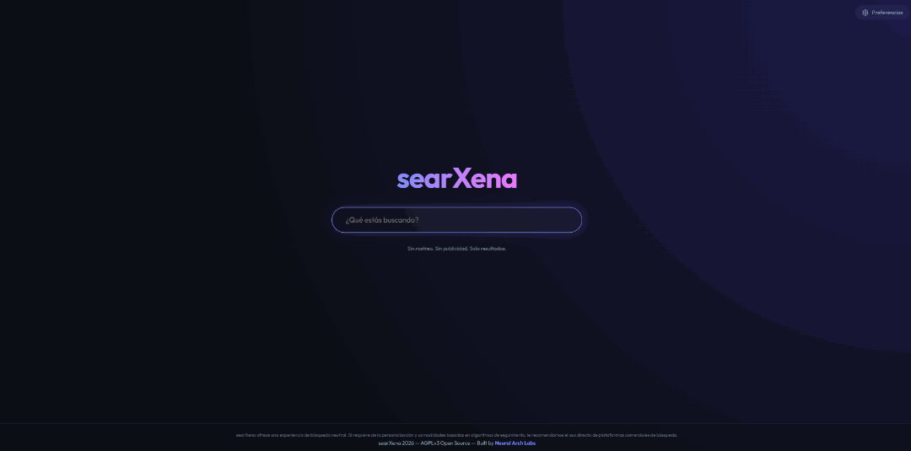
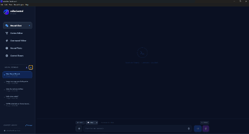
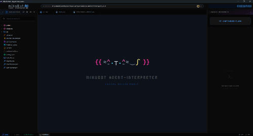

  

    <a href="README.md">Español</a> • 
    <a href="README.en.md">English</a> • 
    <a href="README.zh.md">中文</a>
  

  

  
<i>High-performance engineering with purpose and technical sovereignty.</i>

  

    
    
    
  

 

## 🏛️ About the Lab

Founded by Jaime Martínez to explore AI-driven software development and the integration of local Large Language Models (LLMs), at **Neural Arch Labs** we reject generic technology. We believe in **signature engineering**: solutions designed with character and non-negotiable technical sovereignty to give absolute control back to the user. We don't build cold tools; we design digital infrastructure that respects privacy and identity in the AI era.

---

## 🚀 Active Development & Internal Projects

 

### [🔍 searXena](https://github.com/NeuralArchLabs/searXena)
> **STATUS:** `Public Release` | **ENVIRONMENT:** `Native Windows`

  

 
Our flagship metasearch engine. An agile, private, and 100% native Windows system. Developed to serve as the sovereign link between AI Agents and the global web.
<ul>
  <li><b>Absolute Privacy:</b> <i>Zero-logs</i> architecture and active proxification.</li>
  <li><b>Direct Execution:</b> Instant interaction, without relying on third-party clouds.</li>
</ul>

---

### 📦 mikuBot Dashboard
> **STATUS:** `Internal Development` | **ENVIRONMENT:** `Windows (Electron)`

  

 
An AI agent and assistant aimed at the general public. Designed as a friendly, easy-to-install alternative to complex tools like OpenClaw, making it ideal for non-tech-savvy users.
<ul>
  <li><b>Autonomy & Operating Modes:</b> Features a <b>Chat Mode</b> and an <b>Agent Mode</b> tailored for different types of assistance, both with native system tool execution. Choose between a <i>fully autonomous mode</i>, a <i>safe mode</i> (requires user authorization before execution), and the creation of <b>scheduled tasks</b> for complete autonomy.</li>
  <li><b>Context Library:</b> A module to create, store, and access protocols and documents, making them readily available to reference, review, improve, or apply with the assistant at any time.</li>
  <li><b>Voice & 24/7 Connectivity:</b> Includes native voice recognition <i>out of the box</i> (via Vosk) in English and Spanish for voice dictation and messages. It easily links with Telegram (via BotFather) to run 24/7 and maintain a permanent, efficient communication channel.</li>
  <li><b>Portability & Backup:</b> Allows a complete memory dump into a compressed file to back up your entire assistant, including sessions, personalizations, memory, <i>skills</i>, and access keys.</li>
  <li><b>Windows-First Focus:</b> Built with Electron for scalability, but currently focused 100% on Windows for seamless native integration with <b>searXena</b>, with no short-term plans for other OS ports.</li>
</ul>

---

### ⚡ mikuBot Agent-Interpreter IDE
> **STATUS:** `Coming Soon` | **ENVIRONMENT:** `Windows (Electron)`

  

 
A minimalist IDE with an incredibly friendly and intuitive interface, excellent for people with little to no technical knowledge. It empowers anyone to build professional-grade applications in an IDE environment using only free web chatbots (Gemini, ChatGPT, Grok, etc.).
<ul>
  <li><b>Bridge Architecture:</b> The user instructs the web model about its role using a simple copy-paste prompt.</li>
  <li><b>Agile Execution:</b> The model emits <code>tool_calls</code> in JSON format. The agent-interpreter agilely captures and executes them locally upon user approval.</li>
  <li><b>The Best Quota-Free Alternative:</b> The perfect backup option to keep coding seamlessly when you run out of usage quotas for paid agents like Antigravity, Claude Code, or GitHub Copilot.</li>
</ul>

---

## 🛸 Our Operating Philosophy
<ul>
  <li><b>Local Sovereignty:</b> The power resides in the user's hardware.</li>
  <li><b>Soul in the Code:</b> Every line has a technical intention. We strive for efficiency and stability.</li>
  <li><b>Independent Ecosystem:</b> We operate hermetically to preserve the purity of our vision. <b>We are not open to external contributions to the codebase at the moment, but we keep our code open for review.</b></li>
</ul>

---

## 🤝 Contact and Projects

Although our lab maintains a closed internal development cycle, we are always willing to listen to good ideas.

If you are interested in our technological approach and want to **work with us or propose a project**, send us a direct message through our official profile to chat about it.

 

  
<code>[ NEURAL_ARCH_LABS // EST. 2026 ]</code>

  

